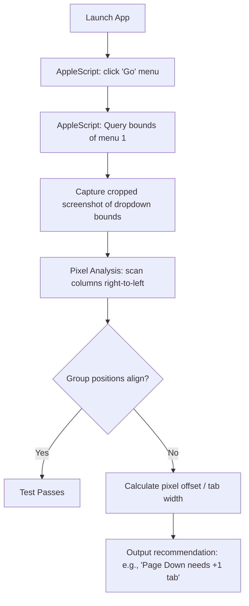

# Native Menu Alignment Testing

Because macOS native menu bars are rendered outside the webview (drawn by the OS Window Server), standard web-testing frameworks like Playwright or Cypress cannot directly inspect their layouts. 

To automate the alignment validation of the alternate shortcut keys (like `(fn+◀)`), we can combine **macOS GUI Scripting (AppleScript)** and a **lightweight image analysis helper**.

---

## 🏗️ Testing Architecture



## ⚙️ macOS Security & Accessibility Requirements

Because the tester simulates clicks on the native OS menu bar and captures a cropped screenshot of the menu dropdown coordinates, macOS requires you to grant assistive permissions to your terminal application. Without these settings, commands will fail with `assistive access not allowed` or return black/blank screenshots.

### 1. Grant Accessibility (Assistive) Permissions
To allow AppleScript (`osascript`) to control the native window menus:
1. Open **System Settings** on your Mac.
2. Go to **Privacy & Security** > **Accessibility**.
3. Under the list of allowed applications, locate your terminal client (e.g. **Terminal**, **iTerm2**, or **Visual Studio Code** if running scripts inside the editor shell).
4. **Toggle the switch to ON**. (If your terminal app is not listed, click the **`+`** button at the bottom of the list, find your terminal application in your Applications folder, and add it).

### 2. Grant Screen Recording Permissions
To allow the native `screencapture` tool to capture the coordinates of the open dropdown:
1. Go to **Privacy & Security** > **Screen & System Audio Recording**.
2. Locate your terminal client (e.g. **Terminal**, **iTerm2**, or **Visual Studio Code**).
3. **Toggle the switch to ON**.

---

## 1. Automated GUI Interaction (AppleScript)

AppleScript allows us to programmatically trigger clicks on the native menu bar and query coordinates of OS-rendered elements using the Accessibility (`AXUIElement`) APIs:

```applescript
tell application "System Events" to tell process "Codeoba"
    -- 1. Click the Go menu bar item to open the dropdown
    click menu bar item "Go" of menu bar 1
    
    -- 2. Query the exact position and bounds of the menu list
    tell menu bar 1 to tell menu bar item "Go" to tell menu 1
        get {position, size}
    end tell
end tell
```

This returns the bounds, for example: `{{100, 45}, {280, 450}}` (representing `$X, Y, \text{Width}, \text{Height}$`).

---

## 2. Screenshot & Crop

Using the coordinate bounds retrieved above, we capture a targeted screenshot of the dropdown window using the native macOS `screencapture` tool:

```bash
screencapture -x -R 100,45,280,450 /tmp/menu_dropdown.png
```

---

## 3. Pixel Scanner & Alignment Verification

Using a standard image processing library (like `sharp` in Node.js or `Pillow` in Python), we scan horizontal rows of pixels for the four menu items.

Since the menu runs in a dark theme, the background has a consistent dark color. The text characters render as bright white/green pixels.

For each menu item row:
1.  **Skip the Primary Accelerator**: Scanning from right to left, we first cross the native shortcuts column (e.g. `⤒`, `⤓`). We skip this section.
2.  **Find the Alternate Shortcut Edge**: Continue scanning left until we hit the next block of white pixels. This coordinate `$X_{\text{edge}}$` represents the rightmost edge of the alternate shortcut string `(fn+◀)`.

### Alignment Assertions
Compare the `$X_{\text{edge}}$` values across all four rows:
$$\Delta = |X_{\text{edge\_max}} - X_{\text{edge\_min}}| \le 2\text{ pixels}$$

---

## 4. Feedback & Tab Adjustments Recommendation

If the items stagger, the test can calculate the exact corrective action. Since a tab stop in 13pt San Francisco is approximately **24 pixels wide**:

$$\text{Adjustment} = \frac{X_{\text{target}} - X_{\text{current}}}{24.0}$$

*   If the result is $\approx -1.0$: the test outputs `Page Down needs one less \t`.
*   If the result is $\approx +1.0$: the test outputs `Page Down needs one more \t`.
